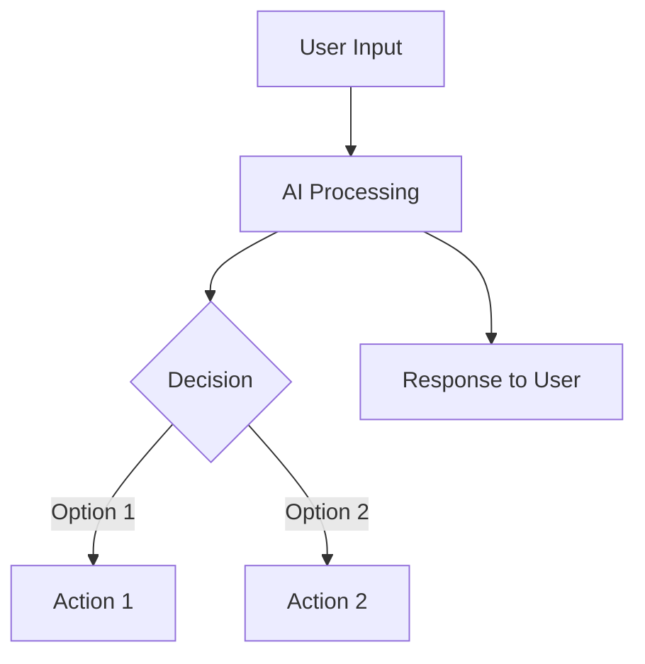

# Backend-Focused AI Integration

## AI Architecture and Flows

```mermaid
flowchart TD
    A[User Input] --> B[AI Processing]
    B --> C{Decision}
    C -->|Option 1| D[Action 1]
    C -->|Option 2| E[Action 2]
    B --> F[Response to User]
```

This section describes the backend integration for AI processing, including architecture and decision flows.